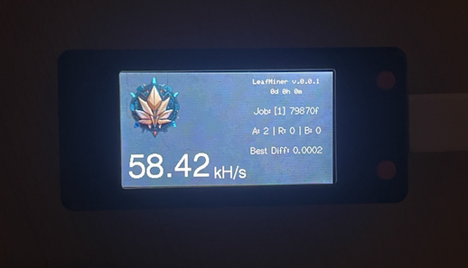
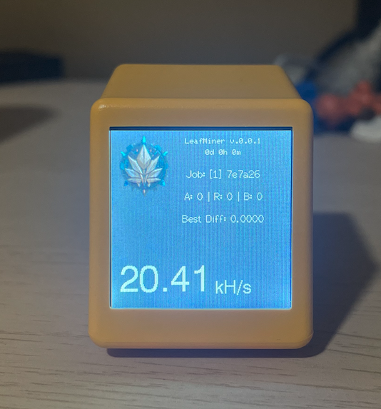

# LeafMiner ☘️⛏️

LeafMiner is a Free and Open Source Software (FOSS) ESP(\*) device Bitcoin miner.

**Disclaimer:** While the chances of successfully mining a block with LeafMiner are highly unlikely due to the current complexity, the primary goal of this project is to serve as a learning platform for gaining a deeper understanding of how Bitcoin and SHA256 operate.

|  |  |
| :------------------------------------------------------------------ | :-------------------------------------------------------------------------------------------- |
| _Lilygo-T-S3_                                                       | _GeekMagic Clock - SmallTV_                                                                   |

## Features

- [x] SHA256 Optimization for 64 + 16 structure (aka Midstate)
- [x] Double Hash Early Exit
- [x] Support for ESP32 and ESP8266
- [x] Mass deploy

The SHA256 code is based on a tweaked version of [NerdSHA256plus](https://github.com/BitMaker-hub/NerdMiner_v2) by NerdMiner.

## Supported Boards:

| Board             | Status | Expected Hashrate |
| :---------------- | :----: | :---------------- |
| ESP8266           |   🟧  | ±16 kH/s          |
| ESP32             |   🟩   | ±48 kH/s          |
| ESP32-S2          |   🟩   | ±19 kH/s          |
| ESP32-S3          |   🟩   | ±80 kH/s          |
| LILYGO-T-S3       |   🟩   | ±80 kH/s          |
| SMALLTV (ESP8266) |   🟩   | ±16 kH/s          |

_Legend_
| Icon | Description |
| :--- | :-------------- |
| 🟩 | Fully functional |
| 🟧 | Partially functional |
| 🟥 | Not working |

## Mining Method:

- [x] [Solo](docs/solo-mining.md)
- [ ] [Cascade](docs/cascade-mining.md) (aka 1 Main and N nodes)

# How to Use

## Requirements

- A supported board
- (optional) VSCode + Platformio.io

## Build & Install

### Flash Binary

- Download the binary file for your board

| Board                                                    | Link                                                         |
| :------------------------------------------------------- | :----------------------------------------------------------- |
| [ESP8266](https://s.click.aliexpress.com/e/_EuwffHJ)     | [0.0.17](https://github.com/matteocrippa/leafminer/releases) |
| [GeekMagic SmartTV]()                                    | [0.0.17](https://github.com/matteocrippa/leafminer/releases) |
| [ESP32](https://s.click.aliexpress.com/e/_Ey6AJnT)       | [0.0.17](https://github.com/matteocrippa/leafminer/releases) |
| [ESP32-S2](https://s.click.aliexpress.com/e/_EGJcibR)    | [0.0.17](https://github.com/matteocrippa/leafminer/releases) |
| [ESP32-S3](https://s.click.aliexpress.com/e/_EJbAXyl)    | [0.0.17](https://github.com/matteocrippa/leafminer/releases) |
| [LILYGO-T-S3](https://s.click.aliexpress.com/e/_ExRWk6H) | [0.0.17](https://github.com/matteocrippa/leafminer/releases) |

- Browse to [ESPWebtool](https://esp.huhn.me/) using a Chrome based browser and upload the file according to the address in the file name.

For example this is how ESP32-S3 will look like:

### Build from Scratch

- Clone the project
- Open in Platformio
- Upload the project to your board

### Quick Start Guide

Follow these steps to set up your ESP32/ESP8266 with LEAFMINER:

1. **Power Up:**
   Power up your ESP32/ESP8266 device.

2. **Connect to LEAFMINER WiFi:**
   Connect to the WiFi network named "LEAFMINER."

3. **Access Configuration Page:**
   Open your web browser and navigate to [http://192.168.4.1](http://192.168.4.1) if the captive portal doesn't appear automatically.

4. **Provide Information and Save:**
   Fill out the form, click the save button, and then reboot your device.

   We've set _pool.vkbit.com_ as the default solo pool, but feel free to change it to your preference.

**Verification:**
If the setup is successful, you'll see your miner in the stats.

### Resetting Setup

If you need to reset the setup flow:

- **For ESP32:**
  Unplug the USB cable, press and hold the BOOT button, and then plug in the USB cable.

- **For ESP8266:**
  Unfortunately, you need to erase the flash and reflash, as there's only a physical button for this.

After resetting, rediscover the _LEAFMINER_ WiFi and go through the setup process again.

## Mass Deploy

Starting from version **0.0.6**, we now offer the capability for mass deployment through Platformio. If you need to apply the same configuration to multiple devices, simply modify the `massdeploy.h` file, uncomment the relevant lines, and customize the parameters according to your requirements. This allows you to effortlessly deploy a pre-configured firmware to multiple devices.

## Donate

If you want to support this project, consider donating:

|                     |                                                  |
| :------------------ | :----------------------------------------------- |
| AliExpress Referral | Use referral links in the list of hardware above |
| ⚡️ Lightning       | `leafminer@lifpay.me`                            |
| Bitcoin             | `bc1quqr7agnx6e0k9kn8h24zfj5dueeurhzflt3qjg`     |

## Credits

Inspired by:

- [HAN](https://github.com/valerio-vaccaro/HAN)
- [NerdMinerv2](https://github.com/BitMaker-hub/NerdMiner_v2)
- [Jade](https://github.com/Blockstream/Jade/tree/miner_all_0.1.47/components/miner)

Useful documentation:

- [Solominer](https://github.com/iceland2k14/solominer/blob/main/solo_miner.py)
- [pyminer.py](https://github.com/jgarzik/pyminer/blob/master/pyminer.py)
- [Stratum Protocol](https://reference.cash/mining/stratum-protocol)
- [Stratum Protocol Diagram](https://github.com/aeternity/protocol/blob/master/STRATUM.md)
- [NBits](https://learnmeabitcoin.com/technical/bits)
- [Bitcoin Mining](https://www.righto.com/2014/02/bitcoin-mining-hard-way-algorithms.html)
- [How To Mine](https://gist.github.com/Ending2015a/70373b2f6f665a765b4d0b0c427f052b)
- [Image Converter 565](http://www.rinkydinkelectronics.com/t_imageconverter565.php)
- [Lilygo-T-Display-S3](https://github.com/Xinyuan-LilyGO/T-Display-S3/tree/main)
