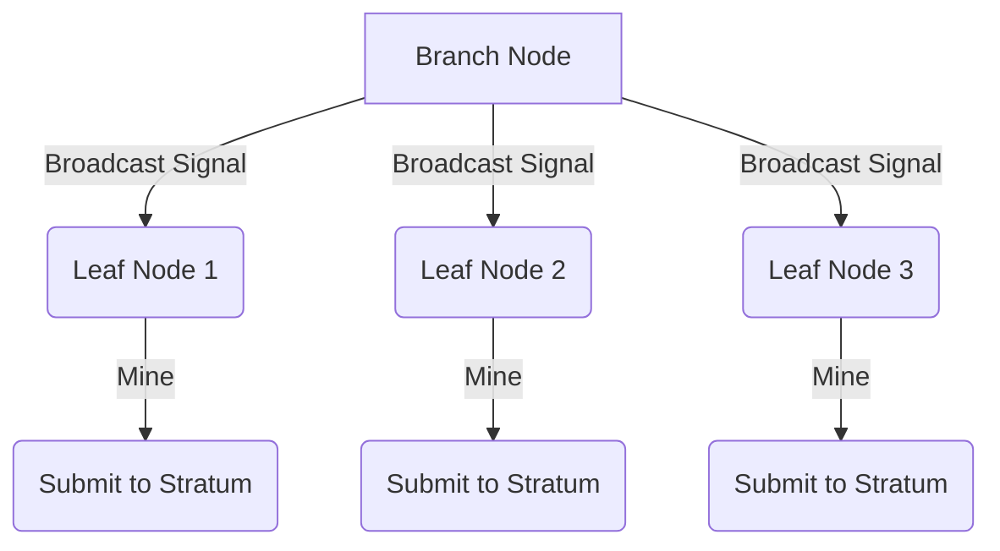

# Cascade Mining

## Mining Process Flowchart

## Description

Cascade mining involves, a two actors implementation.
A branch node and several leaf nodes (up to 3 in the optimal setup).

Each component is able to mine at full speed. For further details read the [performances](../README.md#Supported-Boards) details in readme file.

### Branch Node

Exposes, via mDNS, a broadcast signal to all the leaves.

At the ack of the connection with a leaf, the branch node provides:

- job identifier
- starting nonce value
- midstate hash

The branch then awaits for the job completion of each leaves and takes care to submit to stratum.

#### How the starting nonce is calculated?

It's for now pretty simple implementation, according that nonces can run between 0 and 4,294,967,295 we start to split in halves.

So with a simple scheme:

| Branch            | Leaf 1                        |
| ----------------- | ----------------------------- |
| 0 - 2.147.483.647 | 2.147.483.648 - 4,294,967,295 |

| Branch            | Leaf 1                        | Leaf 2                        |
| ----------------- | ----------------------------- | ----------------------------- |
| 0 - 1.431.655.765 | 1.431.655.766 - 2.863.311.530 | 2.863.311.531 - 4,294,967,295 |

### Leaf Node

Each leaf has basically 3 tasks:

- get a job
- calculate hash starting from midstate and incrementing nonce
- send back successful hashes to branch
