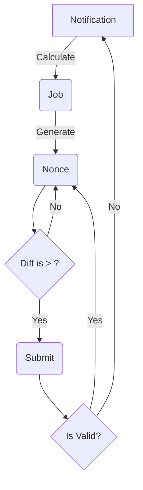

# Solo Mining

## Mining Process Flowchart

## Description

Solo mining is a straightforward approach to handling a mining job.
As illustrated in the graph above, the process involves fetching a job from a stratum, generating an incremental nonce, and applying the double SHA256 hashing algorithm.

To enhance performance, consider implementing the following optimization techniques:

- **Midstate Optimization:** Optimize the calculation of the midstate to improve efficiency during the mining process.
- **Early Exit Strategy:** Implement an early exit strategy to avoid unnecessary computations and increase overall mining speed.

## Usage

The first nonce in this case is always set to 0 and is incremented at each iteration. In the scenario of multiple cores, each core participates in incrementing the nonce value, effectively doubling the mining speed compared to using a single core.
